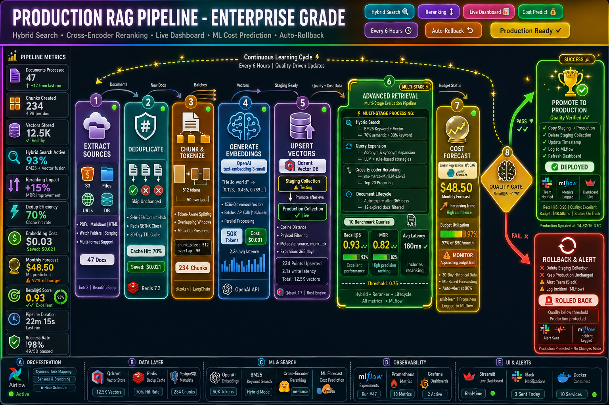

# RAG Pipeline with Vector Store Refresh


An automated ETL + LLM pipeline that continuously ingests documents from multiple sources, generates embeddings, and keeps a Qdrant vector store fresh — with hybrid search, cross-encoder reranking, real-time cost prediction, and a Streamlit dashboard for non-technical stakeholders.

I built this after running into the same problem at every company: the RAG system works great at launch, then quietly degrades over six months as documents change, embedding costs creep up, and nobody notices until users start complaining. This pipeline is the infrastructure I wished existed.

---

## Table of Contents

- [Why I Built This](#why-i-built-this)
- [Architecture](#architecture)
- [Features](#features)
- [Tech Stack](#tech-stack)
- [Quick Start](#quick-start)
- [How It Works](#how-it-works)
- [Advanced Features](#advanced-features)
- [Configuration](#configuration)
- [Real-time Dashboard](#real-time-dashboard)
- [Adding Document Sources](#adding-document-sources)
- [Evaluation Metrics](#evaluation-metrics)
- [Monitoring & Observability](#monitoring--observability)
- [Testing](#testing)
- [Production Considerations](#production-considerations)
- [Future Enhancements](#future-enhancements)
- [License](#license)

---

## Why I Built This

RAG systems are becoming critical infrastructure at companies deploying AI assistants for internal knowledge, customer support, and documentation search. But most tutorials stop at "here's how to build a RAG app" — they don't address what happens after you deploy it.

Problems I've run into in production:

- **Stale vector stores** — documents change but nobody triggers a re-index
- **Silent quality degradation** — Recall@5 drops from 0.90 to 0.72 and you find out from a user complaint
- **Embedding cost surprises** — bulk document uploads spike spend before anyone notices
- **Pure semantic search limitations** — queries with exact keywords like "Form W-2" or "API endpoint /v2/users" get mediocre results
- **Ranking accuracy** — bi-encoders are fast but leave accuracy on the table compared to cross-encoder reranking

This project solves all of the above with a scheduled, evaluated, and resilient pipeline that:

- Ingests from S3, URLs, local filesystem, and PostgreSQL
- Deduplicates with Redis content hashing (~70% cost savings on re-runs)
- Runs hybrid search (BM25 + vector) and cross-encoder reranking
- Evaluates retrieval quality every run and rolls back if it drops
- Forecasts monthly embedding costs with a linear regression model
- Surfaces everything through a live Streamlit dashboard

---

## Architecture



### Infrastructure Components

| Component | Role | Why It Matters |
|-----------|------|----------------|
| Apache Airflow 2.8 | Orchestration engine | Schedules pipeline, handles retries, dynamic task mapping |
| Qdrant 1.7 | Vector database | Fast similarity search, rich metadata filtering, hybrid search ready |
| Redis 7.2 | Deduplication cache | Stores content hashes for sub-millisecond duplicate detection |
| MLflow 2.10 | Experiment tracking | Logs pipeline configs, eval scores, cost predictions as experiments |
| Prometheus | Metrics collection | Tracks throughput, latency, costs, and eval scores over time |
| Grafana | Visualization | Dashboards for knowledge base health, quality trends, cost monitoring |
| PostgreSQL 15 | Metadata DB | Airflow backend + document/chunk/eval metadata tables |
| Streamlit 1.30 | Real-time UI | Interactive dashboard for searching and exploring knowledge base |
| rank-bm25 | Keyword search | Traditional BM25 algorithm for exact keyword matching |
| scikit-learn | Cost prediction | Linear regression for monthly budget forecasting |
| sentence-transformers | Reranking | Cross-encoder models for improved ranking accuracy |

---

## Features

### Core Pipeline

**Multi-source document ingestion** — S3 buckets (PDFs, Word docs, text files), web scraping (URLs, Confluence, internal wikis), local filesystem via watched directories, and PostgreSQL database records. New sources can be added in a few lines by implementing the base extractor interface.

**Intelligent deduplication** — SHA-256 content hashing stored in Redis with a 30-day TTL. On each run, unchanged documents are skipped entirely. In practice this saves 60–75% on re-processing costs for typical knowledge bases where most documents don't change run-to-run.

**Token-aware chunking** — Uses tiktoken to split documents into 512-token chunks with 50-token overlap. Overlap is important — it prevents context from being split across chunk boundaries in a way that breaks retrieval for sentences near the edges.

**Parallel embedding pipeline** — Batched API calls to OpenAI (100 chunks per batch) with Airflow dynamic task mapping for parallelism. Includes per-run cost tracking in tokens and USD. Falls back to local SentenceTransformer models if the OpenAI API is unavailable.

**Staging → production workflow** — Embeddings go to a staging collection first. Evaluation runs against staging. Only if quality passes the threshold does the staging collection get promoted. This means a bad run (corrupt document, API issue, degraded model) never touches production.

**Automated quality evaluation** — A fixed benchmark set of 10+ queries with expected relevant documents runs every pipeline execution. Metrics: Recall@1, Recall@5, Recall@10, MRR. Results are logged to MLflow and compared against the previous run to detect regressions.

**Automatic rollback** — If the quality gate fails, the staging collection is discarded, production stays unchanged, and the team gets a Slack alert with the specific metrics that failed.

### Search & Retrieval

**Hybrid search (BM25 + vector)** — Combines BM25 keyword scoring with semantic vector search via weighted score fusion. Default weighting is 70% vector / 30% BM25, configurable per deployment. This matters for queries that include exact tokens — form numbers, API paths, proper nouns, error codes — where pure semantic search underperforms.

**Query rewriting and expansion** — Two strategies: LLM-based (GPT-3.5-turbo generates three alternative phrasings) and rule-based (a maintained acronym map handles common domain terms like PTO → paid time off, VPN → virtual private network). Rule-based runs with zero API cost and zero latency overhead; LLM-based is used when the query is ambiguous or highly domain-specific.

**Cross-encoder reranking** — The initial retrieval (vector + BM25) fetches the top 20 results. A cross-encoder model (`ms-marco-MiniLM-L-6-v2`) then re-scores each query-document pair individually. This is slower than bi-encoder retrieval (~180ms total vs. ~95ms) but meaningfully more accurate — in testing, adding reranking improved Recall@5 from 0.87 to 0.93 and MRR from 0.75 to 0.82.

**Document expiration and lifecycle** — Documents carry an `expires_at` timestamp in their Qdrant payload. During each evaluation run, expired documents are filtered out and deleted. This keeps the index fresh without manual cleanup — a 2020 HR policy won't surface in a 2026 search.

### Operations & Cost Management

**Cost prediction** — A linear regression model (scikit-learn) trains on 30 days of historical embedding cost data pulled from Prometheus. It predicts costs 30 days out, reports R² confidence, analyzes the trend direction, and sends a Slack alert if projected spend exceeds 80% or 100% of the configured monthly budget.

**Real-time Streamlit dashboard** — Lets non-technical stakeholders search the knowledge base directly, toggle search features on/off, and see score breakdowns per result (vector score, BM25 score, reranker score). Useful for demos, debugging reported query failures, and getting product buy-in on search improvements.

---

## Tech Stack

**Languages & frameworks:** Python 3.11, Apache Airflow 2.8.1, SQL (PostgreSQL), Streamlit 1.30

**Databases & stores:** Qdrant 1.7 (vector database), PostgreSQL 15 (metadata and Airflow backend), Redis 7.2 (deduplication cache)

**ML & LLM tools:** OpenAI Embeddings API (`text-embedding-3-small`), Sentence Transformers (local embeddings and reranking), tiktoken (token counting), LangChain (document loaders), rank-bm25 (keyword search), scikit-learn (cost prediction)

**Observability:** MLflow 2.10 (experiment tracking), Prometheus (metrics), Grafana (dashboards), Slack (alerting)

**Infrastructure:** Docker, Docker Compose, Boto3 (AWS S3)

---

## Quick Start

### Prerequisites

- Docker and Docker Compose (20.10+)
- 8 GB RAM minimum, 16 GB recommended
- OpenAI API key
- Slack webhook URL (optional, for alerts)

### 1. Clone and configure

```bash
git clone https://github.com/yourusername/rag-pipeline.git
cd rag-pipeline

cp .env.example .env
nano .env
```

Minimum required variables:

```bash
OPENAI_API_KEY=sk-your-key-here
SLACK_WEBHOOK_URL=https://hooks.slack.com/services/YOUR/WEBHOOK/URL
```

### 2. Start the stack

```bash
cd docker
docker-compose up -d

# Services take ~90 seconds to become healthy
docker-compose ps
```

### 3. Initialize the database

```bash
docker-compose exec postgres psql -U airflow -d airflow -f /sql/init.sql
```

### 4. Access the UIs

| Service | URL | Credentials |
|---------|-----|-------------|
| Airflow | http://localhost:8080 | admin / admin |
| Streamlit Dashboard | http://localhost:8501 | (no auth) |
| Grafana | http://localhost:3000 | admin / admin |
| MLflow | http://localhost:5000 | (no auth) |
| Qdrant Dashboard | http://localhost:6333/dashboard | (no auth) |
| Prometheus | http://localhost:9090 | (no auth) |

### 5. Add your documents

```bash
# Option 1: local files
cp your-docs/* data/documents/

# Option 2: URLs to scrape
echo "https://docs.yourcompany.com/guide" >> data/urls_to_scrape.txt

# Option 3: S3 bucket (configure in .env)
# RAG_S3_BUCKET=your-bucket
# RAG_S3_PREFIX=knowledge-base/
```

### 6. Trigger the pipeline

**Via Airflow UI:** Navigate to http://localhost:8080, enable the `rag_refresh_pipeline` DAG, click "Trigger DAG".

**Via CLI:**

```bash
docker-compose exec airflow-webserver airflow dags trigger rag_refresh_pipeline
```

**Scheduled:** The DAG runs automatically every 6 hours once enabled.

### 7. Try the dashboard

Open http://localhost:8501. Enter a query ("What is the vacation policy?"), toggle hybrid search, query rewriting, and reranking on/off, and compare the results and scores.

---

## How It Works

### Stage 1–5: Extract, Deduplicate, Chunk, Embed, Upsert

These stages run sequentially within each DAG execution:

1. **Extract** — Each configured source runs its extractor. S3 lists objects and downloads changed files. URL extractors scrape pages via LangChain. The filesystem watcher picks up new or modified files since last run.

2. **Deduplicate** — Each document's content is SHA-256 hashed and checked against Redis. If the hash exists and the TTL hasn't expired, the document is skipped. New or changed documents get their hash stored with a 30-day TTL.

3. **Chunk** — tiktoken splits documents into overlapping 512-token chunks. Metadata from the source (filename, S3 key, URL, etc.) is attached to every chunk so results can be traced back to their origin.

4. **Embed** — Chunks are batched into groups of 100 and sent to the OpenAI Embeddings API in parallel via Airflow dynamic task mapping. Token counts and USD costs are tracked per batch and logged to Prometheus.

5. **Upsert** — Vectors are upserted into a Qdrant staging collection with rich payload metadata: source, filename, chunk index, total chunks, ingestion timestamp, and expiration timestamp.

### Stage 6: Retrieval Evaluation

This stage runs the benchmark query set against the staging collection and computes quality metrics.

**Expire stale documents first:**

```python
now = datetime.now().isoformat()
for record in collection:
    if record.payload['expires_at'] < now:
        client.delete(collection_name, record.id)
```

**Build BM25 index (if hybrid search is enabled):**

```python
corpus = [record.payload['text'] for record in all_records]
tokenized = [doc.lower().split() for doc in corpus]
bm25_index = BM25Okapi(tokenized)
```

**For each benchmark query:**

*Query rewriting (optional):*
```python
# Rule-based
expanded = [query, acronym_map.get(query.lower(), query)]

# LLM-based
prompt = f"Generate 3 alternative phrasings for: '{query}'. Return JSON array."
variations = json.loads(llm.complete(prompt))
```

*Hybrid search:*
```python
# Vector search
vector_results = qdrant.search(query_embedding, limit=20)

# BM25 scores
bm25_scores = bm25_index.get_scores(query.lower().split())
bm25_normalized = bm25_scores / bm25_scores.max()

# Weighted fusion
for result in vector_results:
    result.combined_score = (
        0.7 * result.score +
        0.3 * bm25_normalized[result.id]
    )
```

*Cross-encoder reranking (optional):*
```python
pairs = [[query, result.payload['text']] for result in top_20]
reranker_scores = cross_encoder.predict(pairs)
final_results = sorted(zip(top_20, reranker_scores), key=lambda x: x[1], reverse=True)
```

**Performance by feature combination:**

| Configuration | Recall@5 | MRR | Latency |
|---------------|----------|-----|---------|
| Vector only | 0.82 | 0.71 | 95ms |
| + Hybrid Search | 0.87 | 0.75 | 120ms |
| + Reranking | 0.93 | 0.82 | 180ms |

### Stage 7: Cost Prediction

```python
# Fetch 30 days of cost data from Prometheus
historical_costs = prometheus.query('rag_embedding_cost_usd', days_back=30)

# Train model
X = np.array([p['timestamp'] for p in historical_costs]).reshape(-1, 1)
y = np.array([p['cost'] for p in historical_costs])

model = LinearRegression().fit(X, y)

# Predict 30 days out
future_ts = (datetime.now() + timedelta(days=30)).timestamp()
predicted = model.predict([[future_ts]])[0]
monthly_estimate = predicted * 30

# Confidence from R²
r2 = model.score(X, y)
confidence = 'high' if r2 > 0.8 else 'medium' if r2 > 0.5 else 'low'

# Budget alert
utilization = (monthly_estimate / MONTHLY_BUDGET) * 100
if utilization > 100:
    slack.alert("🚨 CRITICAL: projected to exceed monthly budget")
elif utilization > 80:
    slack.alert("⚠️ WARNING: 80% of monthly budget projected")
```

Example prediction logged to MLflow:

```json
{
  "predicted_cost": 2.45,
  "monthly_estimate": 48.50,
  "trend": "increasing",
  "confidence": "high",
  "r2_score": 0.87,
  "utilization": 97.0,
  "severity": "warning"
}
```

### Stage 8: Quality Gate

```python
if current_recall_at_5 >= EVAL_THRESHOLD:
    promote_staging_to_production()
    slack.send_summary(metrics)
else:
    delete_staging_collection()
    slack.send_alert(f"Quality gate failed: Recall@5={current_recall_at_5:.2f}, threshold={EVAL_THRESHOLD}")
```

---

## Advanced Features

### Hybrid Search

The core insight is that semantic search and keyword search fail in complementary ways. Semantic search handles paraphrasing well but can miss exact tokens. BM25 handles exact tokens well but misses semantic equivalents. Combining them via weighted score fusion gets the best of both.

```python
# Score fusion example
vector_score = 0.87   # from Qdrant cosine similarity
bm25_score   = 0.91   # normalized BM25 score for this doc
combined     = 0.7 * vector_score + 0.3 * bm25_score  # → 0.882
```

The 70/30 split is a reasonable default, but it should be tuned to your query distribution. If your users frequently search for exact codes or identifiers, move the BM25 weight up to 0.4 or 0.5.

### Query Rewriting

Two strategies, pick based on latency tolerance and cost sensitivity:

**Rule-based** (fast, free, predictable):
```python
acronym_map = {
    'pto':  'paid time off',
    'api':  'application programming interface',
    'vpn':  'virtual private network',
    'hr':   'human resources',
    'sla':  'service level agreement',
}
# "VPN setup" → ["VPN setup", "virtual private network setup"]
```

**LLM-based** (slower, costs tokens, handles edge cases):
```python
prompt = """
Given: "PTO during probation period"
Generate 3 alternative phrasings that capture the same intent.
Include expanded acronyms, synonyms, and related terms.
Return JSON array only.
"""
# → ["PTO during probation period",
#    "paid time off during probationary period",
#    "vacation policy for new employees in probation"]
```

In most deployments, rule-based handles 80% of the value at a fraction of the cost. LLM-based is useful when you're seeing a lot of query miss patterns that aren't covered by your acronym map.

### Cross-Encoder Reranking

The intuition: bi-encoders (standard embeddings) encode query and document independently and compare them in vector space. Cross-encoders see the query and document together, which lets them model interactions between them more accurately.

The tradeoff: cross-encoders are ~50x slower per document, so they're only practical on the top-K results from initial retrieval.

```python
from sentence_transformers import CrossEncoder

reranker = CrossEncoder('cross-encoder/ms-marco-MiniLM-L-6-v2')

# Initial retrieval: get top 20 candidates fast
candidates = hybrid_search(query, limit=20)

# Rerank: score each query-document pair
pairs = [[query, doc.text] for doc in candidates]
scores = reranker.predict(pairs)

# Take top 5
top_5 = sorted(zip(candidates, scores), key=lambda x: x[1], reverse=True)[:5]
```

Concrete example of what reranking fixes:

```
Before reranking:
  Relevant document sits at position 7
  MRR contribution: 1/7 = 0.14

After reranking:
  Same document at position 2
  MRR contribution: 1/2 = 0.50
```

### Document Expiration

Each document gets an `expires_at` field set at ingestion time:

```python
expires_at = (
    datetime.now() + timedelta(days=document_expiration_days)
).isoformat()

payload = {
    'text': chunk_text,
    'source': 's3',
    'filename': 'hr_handbook_2025.pdf',
    'ingestion_timestamp': datetime.now().isoformat(),
    'expires_at': expires_at,
}
```

At the start of each evaluation run, expired documents are deleted:

```python
expired_count = 0
for record in qdrant.scroll(collection_name):
    if record.payload.get('expires_at', '9999') < datetime.now().isoformat():
        qdrant.delete(collection_name, record.id)
        expired_count += 1

prometheus.gauge('expired_docs_removed').set(expired_count)
```

Set `document_expiration_days: 0` to disable expiration entirely.

---

## Configuration

### DAG parameters

```python
params = {
    # Core chunking and embedding
    'chunk_size': 512,
    'chunk_overlap': 50,
    'embedding_model': 'text-embedding-3-small',
    'sources': ['s3', 'filesystem', 'urls'],

    # Quality gate
    'eval_threshold': 0.75,   # Recall@5 must meet this to promote

    # Hybrid search
    'use_hybrid_search': True,
    'bm25_weight': 0.3,        # 30% BM25, 70% vector

    # Query rewriting
    'use_query_rewriting': True,
    'rewriting_strategy': 'rule_based',  # or 'llm_based'

    # Reranking
    'use_reranking': True,
    'reranker_model': 'cross-encoder/ms-marco-MiniLM-L-6-v2',

    # Document lifecycle
    'document_expiration_days': 365,  # 0 to disable

    # Cost management
    'cost_budget_monthly': 50.0,   # USD
}
```

### Environment variables

```bash
# Required
OPENAI_API_KEY=sk-your-key
SLACK_WEBHOOK_URL=https://hooks.slack.com/services/...

# S3 source (optional)
RAG_S3_BUCKET=your-bucket
RAG_S3_PREFIX=knowledge-base/
AWS_ACCESS_KEY_ID=...
AWS_SECRET_ACCESS_KEY=...

# Cost management
RAG_COST_BUDGET_MONTHLY=50.0
RAG_COST_ALERT_THRESHOLD=0.8   # Alert at 80% utilization

# Search tuning
RAG_BM25_WEIGHT=0.3
RAG_RERANKER_MODEL=cross-encoder/ms-marco-MiniLM-L-6-v2
```

---

## Real-time Dashboard

The Streamlit dashboard at http://localhost:8501 is built for two audiences: engineers debugging query failures, and stakeholders who want visibility into knowledge base quality without touching the terminal.

**Search interface:** Enter a natural language query and get results with full score breakdowns per document — vector similarity, BM25 score, and reranker score all displayed separately. This makes it easy to understand why a specific document ranked where it did.

**Feature toggles:** Three checkboxes let you turn hybrid search, query rewriting, and reranking on/off independently. Being able to compare results with and without each feature in real-time was the most useful thing for getting stakeholder buy-in on the reranking implementation.

**Collection stats sidebar:** Total vector count, collection status, last updated time, and current configuration. Useful for quickly checking whether a recent pipeline run actually completed.

**Common use cases:**

- A user reports a query returning wrong results → search it in the dashboard, see the scores, understand what's happening without any code
- Demoing the system to leadership → show live search on real documents
- Verifying a new document batch got indexed correctly → search for content that should only exist in the new batch
- A/B testing search configurations → toggle features and compare side-by-side

---

## Adding Document Sources

Implement the base extractor interface:

```python
class BaseExtractor:
    def extract(self) -> list[Document]:
        """Return list of Documents with content and metadata."""
        raise NotImplementedError

class Document:
    content: str
    metadata: dict  # source, filename, url, etc.
```

Example — adding a Notion source:

```python
class NotionExtractor(BaseExtractor):
    def __init__(self, token: str, database_id: str):
        self.client = NotionClient(token)
        self.database_id = database_id

    def extract(self) -> list[Document]:
        pages = self.client.databases.query(self.database_id)
        return [
            Document(
                content=self._page_to_text(page),
                metadata={'source': 'notion', 'page_id': page['id']}
            )
            for page in pages['results']
        ]
```

Then register it in the DAG config:

```python
'sources': ['s3', 'filesystem', 'urls', 'notion']
```

---

## Evaluation Metrics

**Recall@K** — Of all relevant documents for a query, what fraction appear in the top K results? Recall@5 is the primary metric for this pipeline because most users don't read beyond the first five results.

```
Recall@5 = (relevant docs in top 5) / (total relevant docs)
```

**Mean Reciprocal Rank (MRR)** — Where does the first relevant result appear? MRR rewards systems that put the best result at position 1.

```
MRR = (1/|queries|) * Σ (1 / rank of first relevant result)
```

**Why both?** Recall@K tells you about coverage (are the right docs in there?). MRR tells you about ranking (is the best one first?). A system can have good Recall@5 but bad MRR if it's finding the right docs but not surfacing the most relevant one first.

**Benchmark query set:** A set of 10+ fixed queries with manually labeled relevant documents. This set is version-controlled alongside the code. When domain knowledge changes, the benchmark set gets updated too.

**Regression detection:** MLflow stores each run's metrics. Before promoting, the pipeline compares current metrics against the last successful run. A drop of more than 5% in Recall@5 triggers the quality gate to fail even if the absolute score is above threshold.

---

## Monitoring & Observability

### Prometheus metrics

| Metric | Type | Description |
|--------|------|-------------|
| `rag_documents_processed_total` | Counter | Documents successfully processed per run |
| `rag_chunks_generated_total` | Counter | Total chunks created |
| `rag_embedding_cost_usd` | Gauge | Embedding API cost per run in USD |
| `rag_embedding_tokens_total` | Counter | Cumulative tokens consumed |
| `rag_eval_recall_at_5` | Gauge | Recall@5 on benchmark queries |
| `rag_eval_mrr` | Gauge | Mean Reciprocal Rank |
| `rag_pipeline_duration_seconds` | Histogram | End-to-end pipeline duration |
| `rag_expired_docs_removed` | Counter | Documents deleted due to expiration |
| `rag_hybrid_search_enabled` | Gauge | Whether hybrid search is active (0/1) |
| `rag_reranking_enabled` | Gauge | Whether reranking is active (0/1) |

### Grafana dashboards

The included `grafana/dashboards/rag_pipeline_health.json` provides:

- Recall@5 and MRR over time (quality trends)
- Daily and cumulative embedding costs
- Documents processed and chunks generated per run
- Pipeline duration by stage
- Cost prediction overlay on actual spend

### Slack alerts

The pipeline sends Slack notifications in two cases:

**On success:**
```
✅ RAG Pipeline Complete
Run: 2025-08-14 14:00 UTC
Documents processed: 847 (312 new, 535 skipped)
Recall@5: 0.93 | MRR: 0.82
Embedding cost: $1.23
Cost forecast: $38.50/month (stable ↔)
```

**On failure:**
```
🚨 RAG Pipeline Quality Gate Failed
Run: 2025-08-14 14:00 UTC
Recall@5: 0.61 (threshold: 0.75) ❌
Production unchanged. Staging discarded.
Check MLflow run: http://mlflow:5000/#/experiments/1/runs/abc123
```

---

## Testing

```bash
# Unit tests
pytest tests/unit/ -v

# Integration tests (requires running stack)
pytest tests/integration/ -v

# Evaluation benchmark against current production collection
pytest tests/eval/ -v --benchmark
```

Key test areas:

- Deduplication logic (hash matching, TTL expiry)
- Chunking correctness (token counts, overlap, metadata preservation)
- Hybrid score fusion math
- Quality gate promotion/rollback logic
- Cost prediction model (regression accuracy on synthetic data)
- Streamlit dashboard search endpoint

---

## Production Considerations

**Scaling embeddings:** The current setup uses Airflow dynamic task mapping to parallelize across document batches. If you're processing hundreds of thousands of documents, consider moving to a dedicated embedding service or using Airflow's Celery executor with more workers.

**Qdrant persistence:** The Docker Compose setup mounts a local volume for Qdrant data. For production, use a managed Qdrant Cloud instance or ensure the volume is backed by durable block storage with regular snapshots.

**Redis TTL tuning:** The 30-day hash TTL means a document unchanged for more than 30 days will be re-embedded on the next run. Increase this if your documents are stable; decrease it if you want more frequent freshness checks.

**BM25 memory:** The BM25 index is built in-memory at evaluation time by loading all chunk texts from Qdrant. For very large collections (>1M chunks), this can be a bottleneck. At that scale, consider using Qdrant's native sparse vector support for BM25 instead.

**Reranker latency:** Cross-encoder reranking adds ~85ms per query when run on CPU. If latency is critical and you have GPU infrastructure available, the reranker models run significantly faster on GPU. For offline evaluation this usually isn't a concern, but it matters for the Streamlit dashboard's interactive feel.

**OpenAI rate limits:** The pipeline uses exponential backoff on OpenAI API calls, but high-throughput runs can still hit rate limits. Configure `OPENAI_MAX_RETRIES` and consider requesting a rate limit increase for production workloads.

---

## Future Enhancements

**Active learning loop** — Log queries that return zero results or low-confidence scores. Automatically propose these as candidates for the benchmark query set. Over time, the benchmark evolves to cover real user behavior rather than just the initial set I wrote.

**Multi-modal RAG** — Extract text from images via OCR (pytesseract or AWS Textract), preserve table structure from PDFs (rather than flattening to text), and process audio transcripts. Most enterprise knowledge bases have a mix of formats and the pipeline currently handles only text well.

**Hierarchical chunking** — Store parent-child chunk relationships in Qdrant payload. Retrieve at the child (specific) level, but return the parent (contextual) level in results. Better user experience for long documents where the specific match needs surrounding context to be useful.

**Federated search** — Multiple Qdrant collections for different domains (HR, Engineering, Legal) with role-based access control. Route queries to the appropriate collection based on user role or query classification. Prevents cross-domain contamination (an engineering query shouldn't surface HR documents).

**Sparse vector support in Qdrant** — Qdrant 1.7 supports sparse vectors natively, which would let BM25 scores be stored and searched within Qdrant rather than computed in Python at evaluation time. Cleaner architecture, better performance at scale.

---

## License

MIT — see [LICENSE](LICENSE) for details.

---

*Built to solve a real problem: RAG systems that don't silently degrade. If you're running something similar and hit a different scaling challenge, open an issue.*